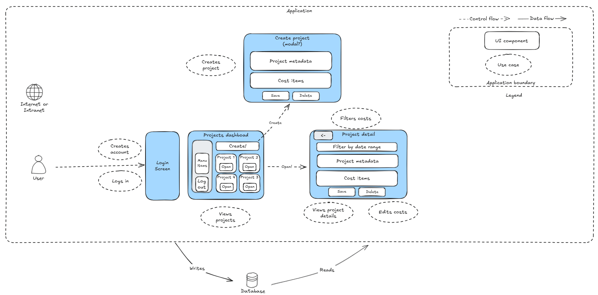
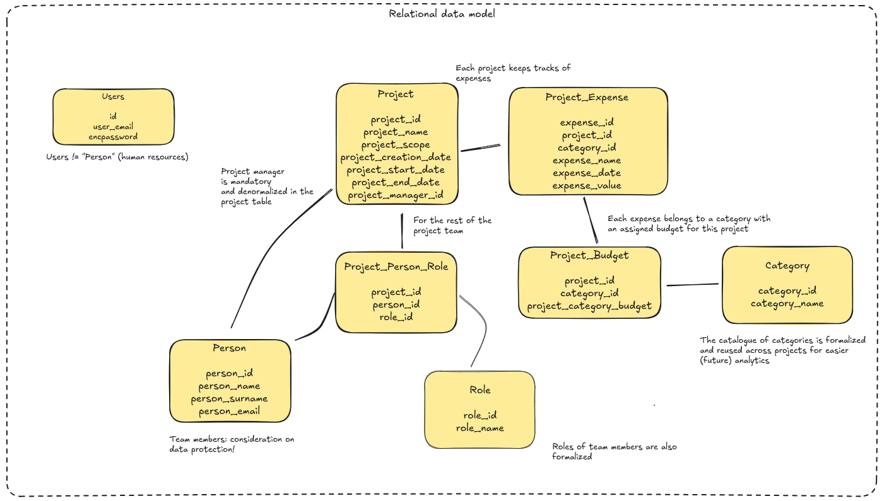
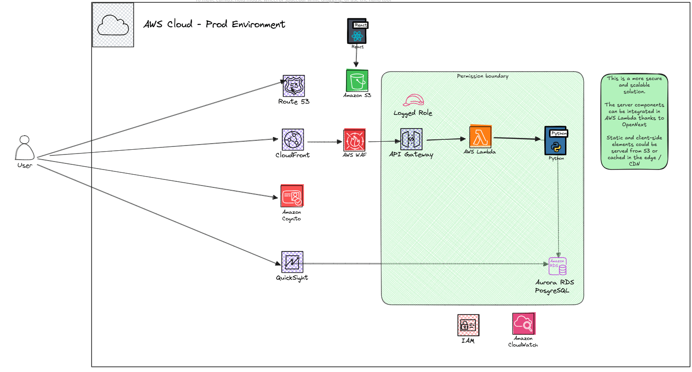

# App
Phronex is a project management and budgeting tool for small and medium sized companies.
It's been development as part of an assignment for a job interview. Also, it's been developed as a personal project out of interest to learn latest Next JS 15 and React 19.
The development time for this assignment is 7 days.

The demo project is deployed under http://phronex.alienmind.eu (or at least will be for a few days).

## App name
The name is derived from the Greek word "Phronesis" (φρόνησις), which means practical wisdom or prudence—especially the kind used in decision-making, planning, and budgeting. The name Phronex captures the essence of thoughtful planning and managing resources, which fits perfectly for a project budgeting web application. Plus, it sounds modern and catchy 😉

<p align="center">
  
</p>

# Requirement analysis

## Functional requirements
The requirements were analyzed and the main use cases were identified:

- Explicit use cases
   - I as a user should be able to add project expenses.
   - I as a user should be able to edit each expense (set category: consultancy, services, licenses, operations, ...)
   - I as a user should be able to search expenses over time range

- Underlying (implicit) use cases derived from the previous ones (that will be done at best effort)
   - Being able to login / logout
   - Create a new project or edit its metadata
   - Edit individual cost details, not only the category (e.g. amount, date, description, etc.)
   - Manage cost categories (add new categories, edit existing ones)
   - Assign a budget for each cost category per project (being a budget application seems reasonable)
   - Manage also the human resources (team members) which gives the application a more realistic and real-life scenario

## Non-functional requirements
Technical (non-functional) requirements:
- Clean and documented code.
- Maintainable code.
- Deployed & testable in local environment.

Will do at best effort:
- Scalable cloud deployment

# Deliverables
- The code repository itself Github - you are there!
- This README.md which should include:
  - Instructions on how to set the application up and running.
  - All sources of information clearly stated and referenced (see the appendix down below)
- A presentation (in PDF)
  - 10 mins max
  - Overview: purpose and features
  - Technical implementation: architecture, key components, challenges...
  - Libraries/frameworks with a justification on why they were chosen
  - Live demo, highlight key features and functionalities

# High level ideation
<p align="center">
  
</p>

# Design
<p align="center">
  
</p>

# Architecture Decision Record (ADR)

1. SQL vs NoSQL
  The data model can be expressed naturally as a relational model compared to a NoSQL model.
  There's no realtime updates requirement nor something that could incline the solution to be based in DynamoDB or other key-value stores. Implementing it as a RDBMS makes room also for future data analytics over project expenditures with normal BI tools. The business problem can be easily expressed in SQL. Also there's no strong requirement of using an enterprise RBMS such as Oracle or DB2, therefore the natural choice is using PostgreSQL.

2. Implementation as a SPA or PWA with server components.
  It could be optionally be done mostly as a SPA (client side) but interacting with APIs in the backend.
  However there's no strong requirement to have an API for automation and this adds additional complexity to the solution.
  There's clearly a need for BoF (Backend for Frontend) though, because of the filtering and searching functionalities.
  Therefore, we take a hybrid approach and decide to use:
  - Server actions via direct call from the client component (which will get the info and later hydraated)
  - Restful APIs for all of the operations (to test both integration methods)

3. Technology stack.
  As a consequence of point 2, we opt-in for latest React features (v19) and NextJS v15 which streamlines the application development with this novel approach. NextJS also provides very clear guardrails and opinionated folder structure which increases maintainability.
  It also keeps the (theoretical) application team simpler than, let's say, picking Python for a backend and React for the frontend. A single team of Javascript experts could be implementing both.

4. Cloud of choice.
  We decide for AWS because of being the most widely used cloud service provider and having all of the potentially required infrastructure services that ensure high availability and horizontal scalability in the future.

5. Deployment stack.
  Given the "project budget restrictions" (ehem, we just have one week) - we won't implement the fully scalable solution nor a CI/CD pipeline but anyway will use containers (Docker) as it can be easily ported from local to the cloud using for instance ECS / Fargate, trying to provide as much automation as possible.

6. Thorough testing (waiver).
  No comprehensive unit tests cases have been developed due to budget restrictions, but this would be completely unnacceptable in a real life application.
  Manual testing will be conducted over every major release with a test plan (see below).

7. Risk assessment - Confidentiality.
  We are going to store personal information (People names and surnames). This should be avoided in the production implementation, which should definitely rely in an external identity provider that provides also an API for enriching the identity information in the application tables.
  It is considered but accepted being a demo project with synthetic data.

# Solution architecture

## Lab architecture

<p align="center">
  
</p>

## Prod architecture

<p align="center">
  
</p>


# Building locally
## Prerrequisites
1. Linux (tested on Ubuntu v22.04 and Amazon Linux AMI)
   Could be prepared on Windows or Mac OS X but not tested nor .bat / .sh prepared for that.
2. Docker v27 or up
3. Node v20 / nvm / pnpm. Install with:

```bash
  nvm install v20.11.1
  npm install -g pnpm@latest
```

## Fist steps
1. Clone the project
2. Set up your .secrets file based on dot-secrets-example in the root of the project

## Run / build with docker
Build process somehow requires the database to be up as SSR will require temporarily connect.
It is necessary to bring up a partial docker-compose.yml with just the database up before building.
This is tricky and will be investigated in the future.

All steps are automated in build.sh, just run:
```bash
./build.sh
```

Any subsequent run will just require the default docker-compose.yml file.
```bash
docker compose up -d
```

# Instructions to run locally
2. Run
```bash
./rundev.sh
```

## Access in local mode
1. The application:  http://localhost:3000/
2. PostgreSQL web UI: http://localhost:8080/

## Seed test data (only first time)
1. Access About screen -> Seed (or http://localhost:3000/seed )
   *Note*: This is very insecure and has been done only for demo purposes. The test data can be reset at any point in time by clicking again in this button.

## Build for production
1. Run:
```bash
./build.sh
```
2. Make sure that the image has been uploaded to docker hub or some other container registry.
   For reference, this one is under https://hub.docker.com/repository/docker/alienmind/phronex-web/general
3. Upload docker-dist.tgz to EC2 via scp (follow along the instructions in the appendix II to properly set up the EC2 instance)
4. Set up .secrets file in the EC2 instance
```bash
tar -xzvf docker-dist.tar.gz
./run.sh
```
5. Optionally, set up the DNS entry name to point to the public IP of the EC2 instance or the Elastic IP assigned.

# TODO list (high level)
- [x] Set up project on Github
- [x] High level solution architecture and navigation design
- [x] Decide tech stack (with reasoned defaults)
- [x] Scaffold basic app with the final stack and solve all required dependencies
- [x] Containerized run at least of the dependencies (postgresql)
- [x] V1 : local dev, login screen, basic prototype with static content
- [x] Automate build process
- [x] V2 : Basic application running in docker and in AWS
- [ ] V3 : Feature complete running in AWS
- [ ] V4 : do as many as the "best effort" extras as possible
- [ ] Finalize and adjust final solution architecture documentation
- [ ] Finish up presentation slides as code with revealJS

# Detailed TODO
- [x] .. Scaffold with nextJS (used my own follow up of the official NextJS tutorial + dockerized local postgresql, see references)
- [x] .. Integrate tailwindcss, shadcn/ui, tanstack table and all other required libraries
- [x] .. Visuals - basic screen layout inc. navbar and grid
- [x] .. Landing page
- [x] .. Login screen
- [x] .. Form server action checks
- [x] .. Create project modal & server action
- [x] .. Create the actual data model DDLs and apply locally to postgresql
- [x] .. Projects dashboard
- [x] .. Stop using static data and use actual database for the dashboard
- [x] .. Add a mandatory project manager
- [x] .. Project detail screen inc. metadata, scope, reporting
- [x] .. Implement update project details
- [x] .. Dockerize the web app
- [x] .. Search expenses over time range
- [x] .. Generic feature to edit values in a data table
- [x] .. Generic feature to add a new row to a data table
- [x] .. Generic feature to delete a row from a data table
- [x] .. Editing expenses values or descriptions live from the project detail screen
- [x] .. Add expenses to projects
- [x] .. Edit a expense detail in the project
- [x] .. Delete an expense from the project
- [x] .. Reassign / remove resources or costs to each project in the project detail screen
- [x] .. Administration: manage roles
- [x] .. Administration: manage persons
- [x] .. Administration: manage categories
- [x] .. Administration: manage budget per category per project
- [x] .. Graph to show expenditures per category against budget
- [x] .. Show expenses chart over time in the project expenses table
- [x] .. Project dashboard: expenses vs budget grouped by category
- [x] .. Colors when expenditures are above the estimate
- [ ] .. Colors the project cards based on their overexpend ratio
- [ ] .. Remove the Delete button from the project cards
- [ ] .. Search functionality in the main page

## Identified issues during the development - some of them are not fixed yet
- [x] .. Some of the server / client components had crossed interdependencies which resulted in depending on pg (postgres) for the client component. Fixed.
- [x] .. Create project form have been intermitently broken due to some refactors. Fixed.
- [x] .. Back button not working in About because of security constraints. Fixed.
- [x] .. User auth is broken again - login somehow is a client side component needs to become a proper api or server action. It's been worked around but requires more work.
- [x] .. Filtering by date range is not fully working
- [x] .. Adding a new expense does not apply the right category ("Unknown")
- [x] .. Not all the management tables have working the free text search feature (something afoot with the fake all_columns column)
- [x] .. Filtering expenses over time range is not working - HTTP 400
- [x] .. Calendar picker layout has gone crazy
- [x] .. Fixed People tab since the big refactor of data-table.tsx
- [x] .. Fixed Roles tab since the big refactor
- [x] .. Fixed Expense Categories (... you know the drill)
- [ ] .. Adding a new resource to the project does not work again
- [ ] .. Editing the category over the list works but UI is not refreshed, needs a F5 as a workaround
- [ ] .. Also editing the category in the project details form should update the budget
- [ ] .. When reassigning a resource to a project (changing the person), it works but there's a secondary toast with an unexpected error message. Needs to be investigated.
- [ ] .. Select box does not preselect to 6 projects (visually) and it loses its focus.
- [ ] .. Destroy buttons have lost their red style. There's some CSS mix-up
- [ ] .. Make more consistent the usage of server actions. Currently there's a mix between direct calls and calls from the API. It should be simplified and leave the APIs for whatever is really needed.
- [ ] .. Enhance server validation (error toast should iterate over all errors)

The extras:
- [ ] .. Implement registration screen
- [ ] .. Separate service (Python + FastAPI) that integrates with OpenAI for scope summarization (would be neat)
- [ ] .. Also use OpenAI for structured budgeting scaffolding based on the scope text - try to generate cost items based in the model output in JSON (would be even more neat)
- [ ] .. OAuth 2.0 authentication with Google or Github
- [ ] .. Create project form client validations (currently only in server)
- [x] .. Dark theme
- [x] .. Add easter egg
- [ ] .. Graph resources assignment to projects

# Test plan (on every major release)
- [ ] .. Landing page: click on About, click on seed, click on presentation
- [ ] .. Login
- [ ] .. See dashboard of project cards
- [ ] .. Filter out to 3 projects
- [ ] .. Search for a project by free text
- [ ] .. Add a new project
- [ ] .. Click on a project card
- [ ] .. Check all info is OK (expenses, resources, metadata)
- [ ] .. Edit metadata of the project
- [ ] .. Edit a expense amount or description
- [ ] .. Add a new expense to the project
- [ ] .. Reassign a resource to the project
- [ ] .. Remove a expense
- [ ] .. Repeat basic checks over generic admin pages (cost categories, roles, persons)

# Appendix and references

This project from my Next JS demo project https://github.com/new?template_name=nextjs-postgresql-tutorial&template_owner=alienmind
that I implemented from scratch following the tutorial in https://nextjs.org/learn

Plus some previous work also on a personal project here: https://github.com/alienmind/auditorium-web

It's been scaffolded with:
npx create-next-app@latest phronex --example "https://github.com/vercel/next-learn/tree/main/dashboard/starter-example" --use-pnpm


## Shadcn for premade UI components
I've been adding shadcn (https://ui.shadcn.com/) premade components to the project, together with tailwindcss (https://tailwindcss.com/) theming.
These components are part of the code base althouth they have not been developed by me. It can be considered framework code, although what makes shadcn special is that the source code becomes part of the source code, which allows you to customize it (other than adjusting paths, it's vanilla code from the shadcn project)

Instal:
  npx shadcn@latest init

Successive UI components have been added under components/ui via:

```bash
  npx shadcn@latest add sidebar
  npx shadcn@latest add card
  npx shadcn@latest add alert-dialog
  npx shadcn@latest add dropdown-menu
  npx shadcn@latest add table
  npx shadcn@latest add scroll-area
  npx shadcn@latest add drawer
  npx shadcn@latest add dialog
  npx shadcn@latest add form
  ...
```

I had to adjust the shadcn components to use tailwindcss utility classes by setting tailwind.cssVariables = false in components.json 

## Dockerization of the project

To add support for Docker to an existing project, I used the recommended Dockerfile available in [`Dockerfile`](https://github.com/vercel/next.js/blob/canary/examples/with-docker/Dockerfile) and added the following to the `next.config.js` file:

```js
// next.config.js
module.exports = {
  // ... rest of the configuration.
  output: "standalone",
};
```

This will build the project as a standalone app that can be run inside the Docker image.

# Appendix II : How to properly set up the EC2 instance
## Install on AWS EC2
1. Set up an ubuntu free tier EC2 instance
2. Install docker
```bash
curl -fsSL https://get.docker.com -o get-docker.sh
sudo sh get-docker.sh
sudo usermod -a -G docker ubuntu
newgrp docker
sudo systemctl enable docker.service
sudo systemctl start docker.service

DOCKER_CONFIG=${DOCKER_CONFIG:-$HOME/.docker}
mkdir -p $DOCKER_CONFIG/cli-plugins
curl -SL https://github.com/docker/compose/releases/download/v2.32.2/docker-compose-linux-x86_64 -o $DOCKER_CONFIG/cli-plugins/docker-compose
chmod +x $DOCKER_CONFIG/cli-plugins/docker-compose
```


4. Set up .env
5. Start posgresql with docker

```bash
docker compose up -d
```
Additional steps (potentially):
2. Set up an ALB with a target group pointing to the EC2 instance, port 3000
10. Set up a security group for the ALB with HTTP/HTTPS access
11. Set up a security group for the EC2 instance with SSH access
12. Set up a DNS name for the ALB in Route 53
13. Set up a certificate in ACM for the domain name
...


# References used

It would have been impossible to do this project without the following references, which are great for someone not fully expert in the latest frameworks.

- Theo T3GG Channel and livecoding sessions - https://www.youtube.com/@t3dotgg 
- React Router 7 Tutorial - https://www.youtube.com/watch?v=pw8FAg07kdo
- NextJS Tutorial - https://nextjs.org/learn/dashboard-app/getting-started
- NextJS Tutorial with local PostgreSQL - https://medium.com/@dekadekadeka/next-js-tutorial-with-local-database-quick-start-guide-394d48a0aada
- ShadCN UI components - https://ui.shadcn.com/docs/components
- Lucide icons - https://lucide.dev/icons
- TailwindCSS cheat sheet - https://nerdcave.com/tailwind-cheat-sheet
- PostgreSQL locally with docker-compose https://medium.com/@agusmahari/docker-how-to-install-postgresql-using-docker-compose-d646c793f216
- PostgreSQL official docker image https://hub.docker.com/_/postgres
- Dockerize NextJS app https://nextjs.org/docs/app/building-your-application/deploying#docker-image
- NextJS tutorial with local database https://medium.com/@dekadekadeka/next-js-tutorial-with-local-database-quick-start-guide-394d48a0aada
- How to use Docker with Next.js based on the [deployment documentation](https://nextjs.org/docs/deployment#docker-image).
- Hybrid form validation client & server in Next : https://dev.to/bookercodes/nextjs-form-validation-on-the-client-and-server-with-zod-lbc
- Fix passing date with date picker to nextjs server action: https://www.youtube.com/watch?v=4d2g-yAD7xY
- Properly manage passwords with PostgreSQL: https://www.postgresql.org/docs/8.3/pgcrypto.html
- Fix signIn / signOut in next-auth https://medium.com/@youngjun625/next-js14-nextauth-v5-1-signin-signout-7e30cce52e7f
- Great article on next auth https://medium.com/@youngjun625/next-js14-nextauth-v5-1-signin-signout-7e30cce52e7f 
- Adding OAuth authentication with nextauth.js: https://dev.to/ndom91/adding-authentication-to-an-existing-serverless-next-js-app-in-no-time-with-nextauth-js-192h
- Migrating to latest Next JS Auth https://authjs.dev/getting-started/migrating-to-v5#authenticating-server-side and https://authjs.dev/concepts/session-strategies
- Fix breaking changes on NextJS 15 URL params https://nextjs.org/docs/app/building-your-application/upgrading/version-15#async-request-apis-breaking-change
- Properly handle route params in NextJS https://nextjs.org/docs/app/api-reference/file-conventions/route
- Shadcn + Tanstack table https://ui.shadcn.com/docs/components/data-table
- Shadcn + Tanstack table - Filtering customization https://tanstack.com/table/v8/docs/guide/filters
- React Day Picker - how to fix upgrade to latest version - https://daypicker.dev/upgrading#7-update-your-custom-components 
- RevealJS slides https://revealjs.com/installation/
- Shadcn + Tanstack table - Adding / editing rows https://github.com/shadcn-ui/ui/discussions/2639
- Shadcn Dashboard example https://ui.shadcn.com/examples/dashboard 
