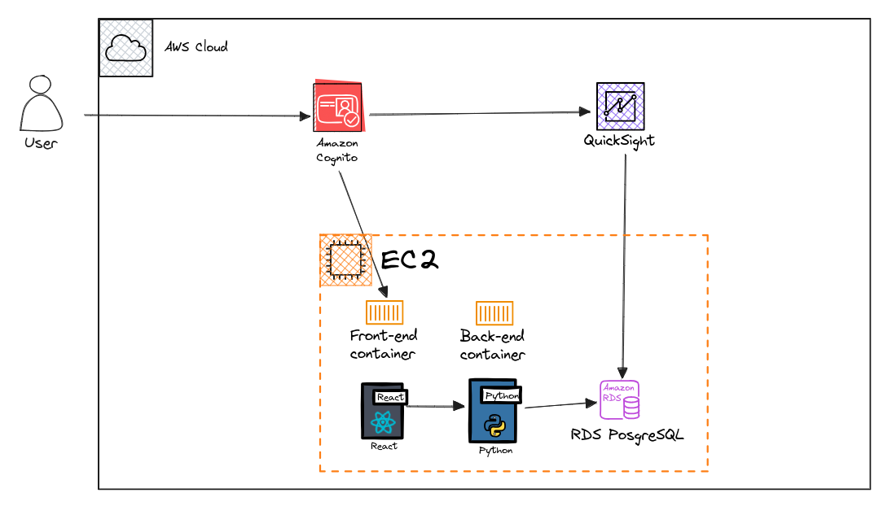
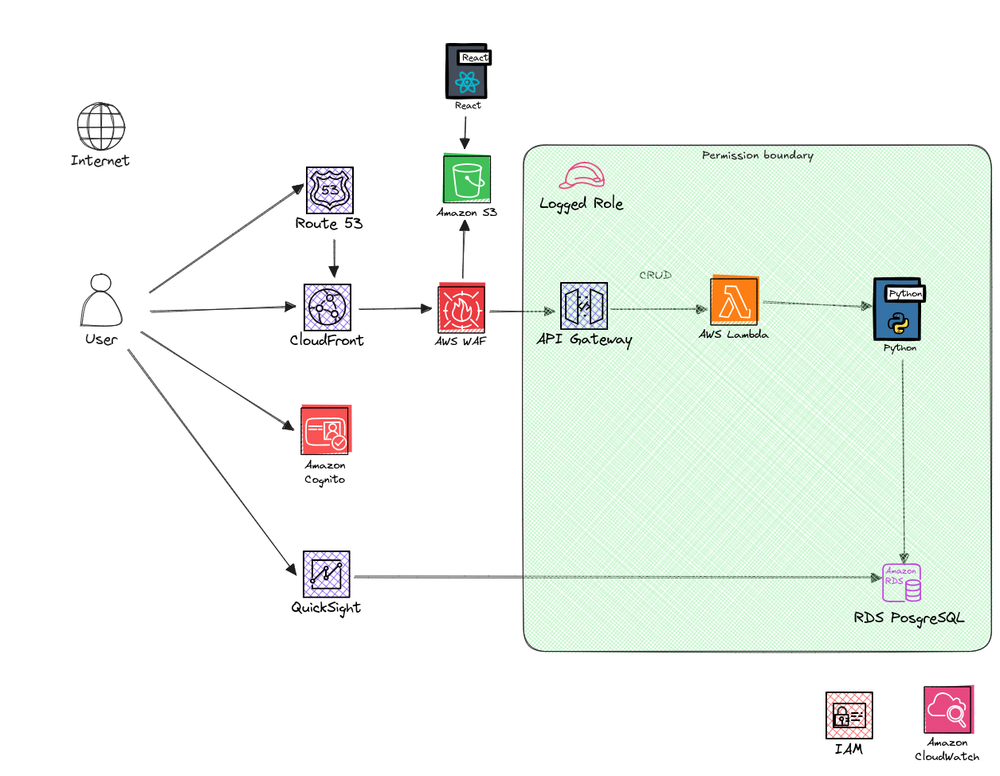

# App
This is a demo project, for learning purposes, to teach me latest Next JS 15 and React 19.

## App name
The name is derived from the Greek word "Phronesis" (φρόνησις), which means practical wisdom or prudence—especially the kind used in decision-making, planning, and budgeting. The name Phronex captures the essence of thoughtful planning and managing resources, which fits perfectly for a project budgeting web application. Plus, it sounds modern and catchy.

<p align="center">
  
</p>

# Task

# High level idea

# Solution architecture

## Lab architecture

<p align="center">
  
</p>

## Prod architecture

<p align="center">
  
</p>


# Prerrequisites
1. Linux (tested on Ubuntu v22.04 and Amazon Linux AMI)
2. Docker v27 or up
3. Node v20 / nvm / pnpm

## Install Node and pnpm

```bash
  nvm install v20.11.1
  npm install -g pnpm@latest
```

## Fist steps
1. Clone the project, 
2. Set up your .env based on .env.template
   cp -p .env.template .env # and edit values

## Run / build with docker
Build process somehow requires the database to be up as SSR will require temporarily connect.
It is necessary to bring up a partial docker-compose.yml with just the database up before building.

All steps are automated in build.sh, just run:
```bash
./build.sh
```

Make sure to keep .env.* files around necessary for the build.

Any subsequent run will just require the default docker-compose.yml file.
```bash
docker compose up -d
```

# Instructions (run locally)
1. Customize your own .env based on .env.localhost
2. Run
```bash
pnpm run dev
```

Or simply:
```bash
./rundev.sh
```

## Access:
1. PostgreSQL access: http://localhost:8080/
2. Web UI access:  http://localhost:3000/

## Seed test data (only first time)
1. Access About screen -> Seed (or http://localhost:3000/seed )

# Instructions (AWS)
TBD

# Folder structure

project-root/
├── src/
│   ├── app/
│   │   ├── (auth)/
│   │   ├── (overview)/
│   │   ├── api/
│   │   ├── dashboard/
│   │   ├── lib/
│   │   ├── ui/
│   │   └── ...
│   ├── components/
│   │   └── ui/
│   └── lib/
├── public/
├── next.config.js
├── package.json
└── tsconfig.json

# TODO list (high level)
- [x] Set up project on Github
- [x] High level solution architecture and navigation design
- [x] Decide tech stack (with reasoned defaults)
- [x] Scaffold basic app with the final stack and solve all required dependencies
- [x] Containerized run
- [x] V1 : local dev, login screen, basic prototype with static content
- [ ] V2 : feature complete in docker
- [ ] V3 : deployed in AWS Fargate, exposed via public ip, DNS name
- [ ] V4 : Prepare analytics with Quicksight
- [ ] Finalize and adjust final solution architecture documentation
- [ ] Project plan to production
- [ ] Prepare presentation slides as code with revealJS


# Detailed TODO
- [x] .. Scaffold with nextJS (used nextJS tutorial + dockerized local postgresql)
- [x] .. Integrate tailwindcss, shadcn/ui, state manager?
- [x] .. Dockerize the web app
- [x] .. Visuals - basic screen layout inc. navbar and grid
- [x] .. Landing page
- [x] .. Login screen
- [x] .. Form server action checks
- [x] .. Create project modal & server action
- [x] .. Create the actual data model DDLs and apply locally to postgresql
- [x] .. Projects dashboard
- [x] .. Stop using static data and use actual database for the dashboard
- [ ] .. Add a mandatory project manager
- [ ] .. Project detail screen inc. metadata, scope, reporting
- [ ] .. Implement update project details
- [ ] .. Implement delete project details with confirmation dialog
- [ ] .. Implement registration screen

# Extras
- [ ] .. Separate service (Python + FastAPI) that integrates with OpenAI for scope summarization
- [ ] .. Also use OpenAI for structured budgeting scaffolding based on the scope text - try to generate cost items based in the model output in JSON
- [ ] .. OAuth 2.0 authentication with Google or Github
- [x] .. Dark theme
- [x] .. Doom
- [ ] .. Create project form client validation (currently only in server)
- [ ] .. Enhance server validation (error toast should iterate over all errors)

## Issues
- [x] .. Create project form is broken again
- [x] .. Back button not working in About
- [ ] .. User auth is broken again - login somehow is a client side component needs to become a proper api or server action
- [ ] .. Create project form should ask for a mandatory project manager
- [ ] .. Select box does not preselect to 6 projects (visually)
- [ ] .. Destroy buttons have lost their red style
- [ ] .. It will be necessary to do an export of the data to a CSV file instead of using seed, as building the artifacts requires access to the tables (chicken and egg problem)

# Appendix

Created from my Next JS demo project https://github.com/new?template_name=nextjs-postgresql-tutorial&template_owner=alienmind

... which was created by me with:
npx create-next-app@latest phronex --example "https://github.com/vercel/next-learn/tree/main/dashboard/starter-example" --use-pnpm

## References used
- React Router 7 Tutorial - https://www.youtube.com/watch?v=pw8FAg07kdo
- NextJS Tutorial - https://nextjs.org/learn/dashboard-app/getting-started
- NextJS Tutorial with local PostgreSQL - https://medium.com/@dekadekadeka/next-js-tutorial-with-local-database-quick-start-guide-394d48a0aada
- ShadCN UI components - https://ui.shadcn.com/docs/components
- Lucide icons - https://lucide.dev/icons
- TailwindCSS cheat sheet - https://nerdcave.com/tailwind-cheat-sheet
- PostgreSQL locally with docker-compose https://medium.com/@agusmahari/docker-how-to-install-postgresql-using-docker-compose-d646c793f216
- PostgreSQL official docker image https://hub.docker.com/_/postgres
- Dockerize NextJS app https://nextjs.org/docs/app/building-your-application/deploying#docker-image
- NextJS tutorial with local database https://medium.com/@dekadekadeka/next-js-tutorial-with-local-database-quick-start-guide-394d48a0aada
- How to use Docker with Next.js based on the [deployment documentation](https://nextjs.org/docs/deployment#docker-image).
- Hybrid form validation client & server in Next : https://dev.to/bookercodes/nextjs-form-validation-on-the-client-and-server-with-zod-lbc
- Fix passing date with date picker to nextjs server action: https://www.youtube.com/watch?v=4d2g-yAD7xY
- Properly manage passwords with PostgreSQL: https://www.postgresql.org/docs/8.3/pgcrypto.html
- Fix signIn / signOut in next-auth https://medium.com/@youngjun625/next-js14-nextauth-v5-1-signin-signout-7e30cce52e7f
- Great article on next auth https://medium.com/@youngjun625/next-js14-nextauth-v5-1-signin-signout-7e30cce52e7f 
- Adding OAuth authentication with nextauth.js: https://dev.to/ndom91/adding-authentication-to-an-existing-serverless-next-js-app-in-no-time-with-nextauth-js-192h
- Migrating to latest Next JS Auth https://authjs.dev/getting-started/migrating-to-v5#authenticating-server-side and https://authjs.dev/concepts/session-strategies
- Fix breaking changes on NextJS url params https://nextjs.org/docs/app/building-your-application/upgrading/version-15#async-request-apis-breaking-change

## Shadcn for premade UI components
I've been adding shadcn premade components to the project, together with tailwindcss theming.

Install https://ui.shadcn.com/docs/installation/vite
  npx shadcn@latest init

Successive UI components have been added under components/ui via:

```bash
  npx shadcn@latest add sidebar
  npx shadcn@latest add card
  npx shadcn@latest add alert-dialog
  npx shadcn@latest add dropdown-menu
  npx shadcn@latest add table
  npx shadcn@latest add scroll-area
  npx shadcn@latest add drawer
  npx shadcn@latest add dialog
  npx shadcn@latest add form
  ...
```

Make sure to set it up to use tailwindcss utility classes by setting tailwind.cssVariables = false in components.json 

## Dockerize it

To add support for Docker to an existing project, just copy the [`Dockerfile`](https://github.com/vercel/next.js/blob/canary/examples/with-docker/Dockerfile) into the root of the project and add the following to the `next.config.js` file:

```js
// next.config.js
module.exports = {
  // ... rest of the configuration.
  output: "standalone",
};
```

This will build the project as a standalone app inside the Docker image.

## Dockerized version - details
Open [http://localhost:3000](http://localhost:3000) with your browser to see the result.
[API routes](https://nextjs.org/docs/api-routes/introduction) can be accessed on [http://localhost:3000/api/hello](http://localhost:3000/api/hello). This endpoint can be edited in `pages/api/hello.js`.
The `pages/api` directory is mapped to `/api/*`. Files in this directory are treated as [API routes](https://nextjs.org/docs/api-routes/introduction) instead of React pages.

## Last minute cleanup things to not forget
- [ ] Hero images
- [ ] Favicon
- [ ] Cleanup secrets?


## Install on AWS EC2
1. Set up a free tier EC2 instance
2. Set up an ALB with a target group pointing to the EC2 instance, port 3000
3. Install all software
```bash
sudo yum install docker python3-pip git -y
sudo pip install docker-compose
sudo usermod -a -G docker ec2-user
sudo systemctl enable docker.service
sudo systemctl start docker.service
curl -o- https://raw.githubusercontent.com/nvm-sh/nvm/v0.40.1/install.sh | bash
. ~/.bashrc
nvm install v20.11.1
npm install -g pnpm@latest
sudo npm install -g pm2
```

4. Set up .env
5. Start posgresql with docker

```bash
docker compose up -d
```
Additional steps (potentially):
10. Set up a security group for the ALB with HTTP/HTTPS access
11. Set up a security group for the EC2 instance with SSH access
12. Set up a DNS name for the ALB in Route 53
13. Set up a certificate in ACM for the domain name
...